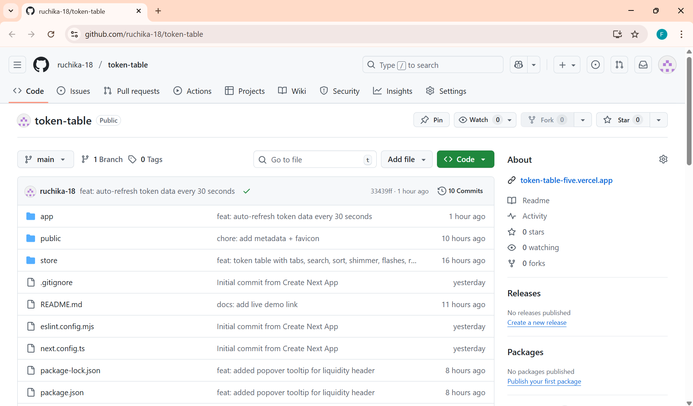

# Token Discovery — Ruchika

##  Live Demo
https://token-table-five.vercel.app  
(Deployed via [Vercel](https://vercel.com))

##  GitHub Repository
https://github.com/ruchika-18/token-table

---

---

## Screenshots

### Desktop View


### GitHub Repository


### Mobile (Responsive) View


---

## What this is
Next.js + TypeScript + Tailwind app with tabs, search, sorting, shimmer loader, 30s auto-refresh, and green/red flashes on changes.


##  About the Project
A fully responsive **Next.js + TypeScript + Tailwind** web app for token discovery.  
It includes tabs, live sorting, search, shimmer loaders, and green/red flashes on updates.

---

##  Features Implemented
 Tabs for token groups (New Pairs / Final Stretch / Migrated)  
 Search with instant filter updates  
 Sorting by price, % changes, volume, and liquidity  
 Shimmer loader during fetch  
 30s auto-refresh for data  
 Flash indicators (green/red) for live changes  
 Liquidity **Popover** (Radix UI)  
 Row-click **Modal** for token details  
 Responsive across mobile and desktop  

> Note: Live tick (SSE) intentionally skipped per task guidelines.

---

## Tech Stack
- **Framework:** Next.js 13+ (App Router)
- **Language:** TypeScript
- **Styling:** Tailwind CSS
- **UI Library:** Radix UI
- **State Management:** Redux (for UI filters)
- **Deployment:** Vercel

---

## Run Locally

```bash
# Install dependencies
npm install

# Run development server
npm run dev

# Visit
http://localhost:3000

---

## Demo Video
Watch the project in action here:  
👉 [Click to Watch on Loom](https://www.loom.com/share/aaa9004641b744dd80bd0019c8143b3d)

